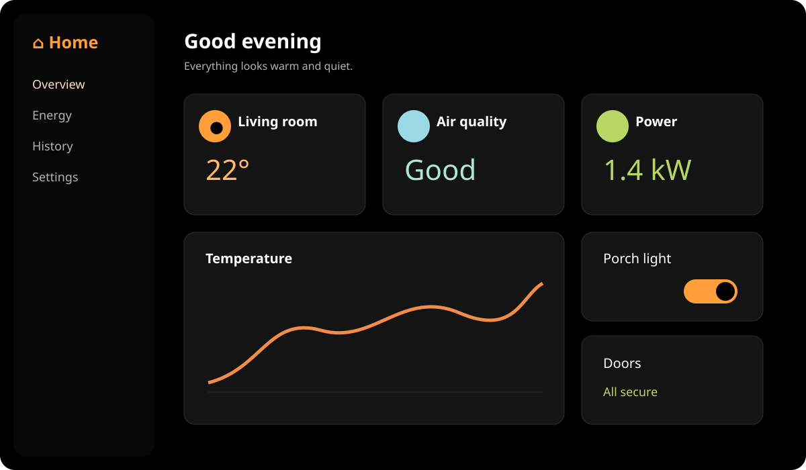
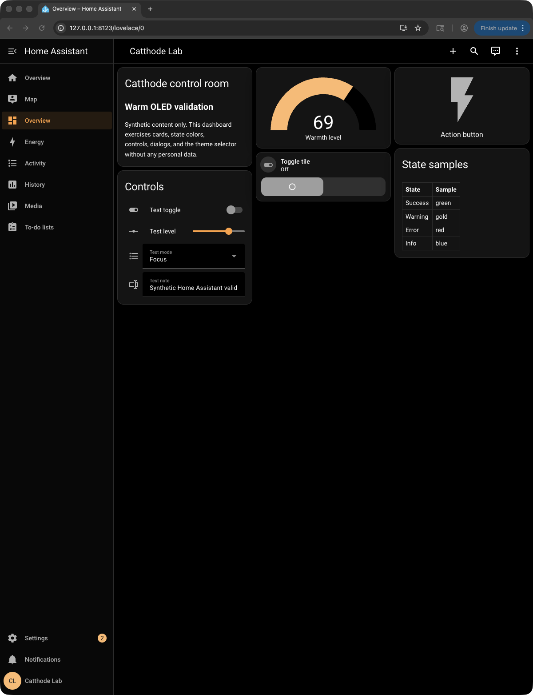
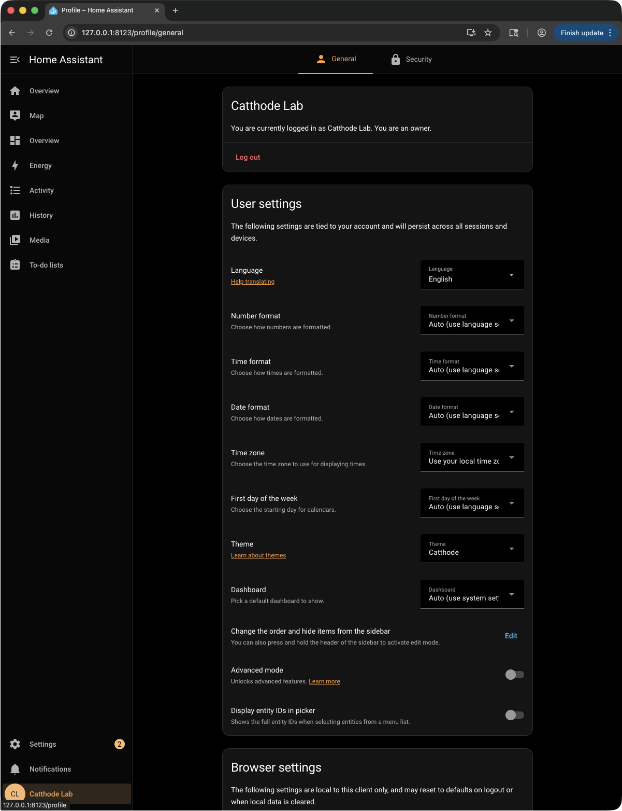
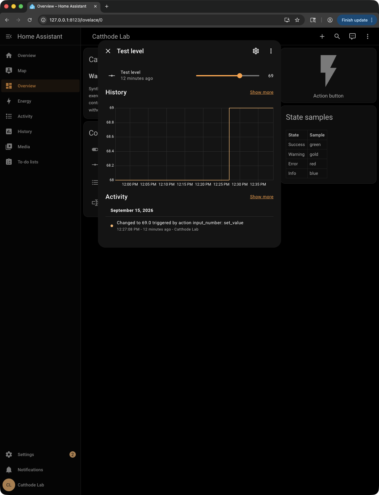

# Catthode for Home Assistant

> **From CRT to OLED.** Bringing warmth back to a world of cold themes. [cattho.de](https://cattho.de/)

[](https://github.com/catthode/home-assistant/actions/workflows/validate.yml)

A warm OLED theme for Home Assistant dashboards, cards, dialogs, controls, state colors, and code editors.



Validated in a disposable Home Assistant Core profile:





## Install with HACS

First make sure Home Assistant loads themes from its `themes` directory. Add this to `configuration.yaml` (or merge the `themes` entry into an existing `frontend` block), then restart Home Assistant once:

```yaml
frontend:
  themes: !include_dir_merge_named themes
```

Until the default HACS catalog submission is accepted:

1. Open HACS.
2. Choose **Custom repositories**.
3. Add `https://github.com/catthode/home-assistant` as category **Theme**.
4. Download **Catthode Theme**.
5. Run the `frontend.reload_themes` action from Developer Tools (or restart Home Assistant).
6. Select **Catthode** under your profile’s **Theme** setting.

## Manual installation

Copy `themes/catthode.yaml` into your Home Assistant `themes` directory, ensure the `frontend` configuration above is present, then run `frontend.reload_themes` or restart Home Assistant.

## What is included

- One dark-mode theme named **Catthode**.
- Warm amber, gold, clay, wheat, and muted green semantic colors.
- Warm graph, history, weather, energy, state, and code-editor aliases to avoid cold default accents.
- No custom cards, integrations, services, telemetry, or external runtime dependencies.

## Validation

CI parses the YAML, checks required semantic tokens, and runs the official HACS theme validator. The repository also includes privacy-safe dashboard, profile, and entity-dialog captures from a disposable Home Assistant Core validation profile.

The theme is intentionally limited to Home Assistant’s supported theme variables; individual custom cards or integrations may define their own styling outside a theme’s control.

## License

MIT
